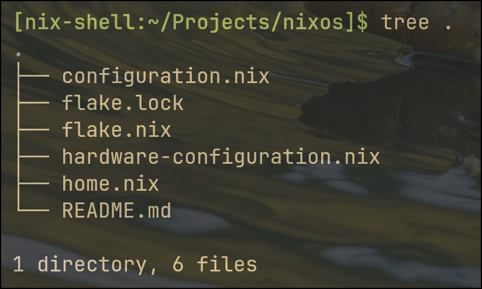
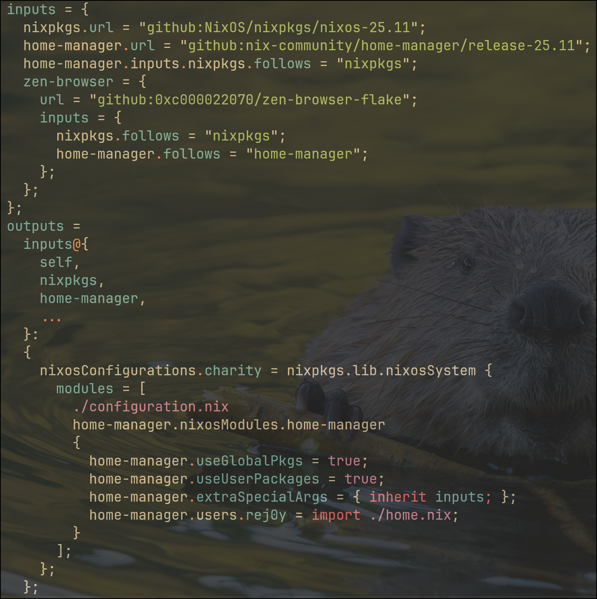
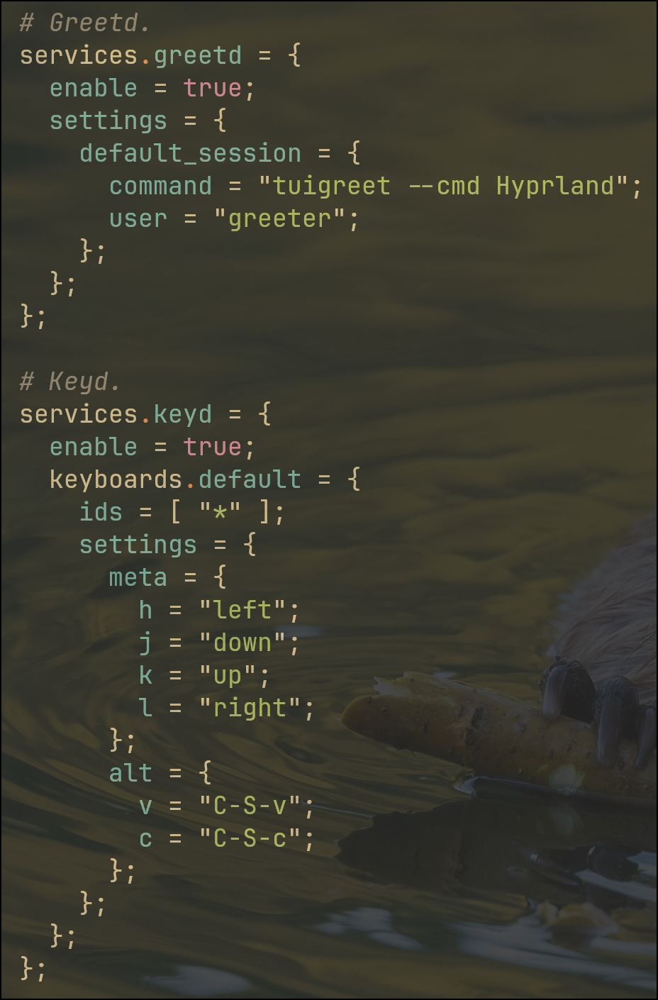
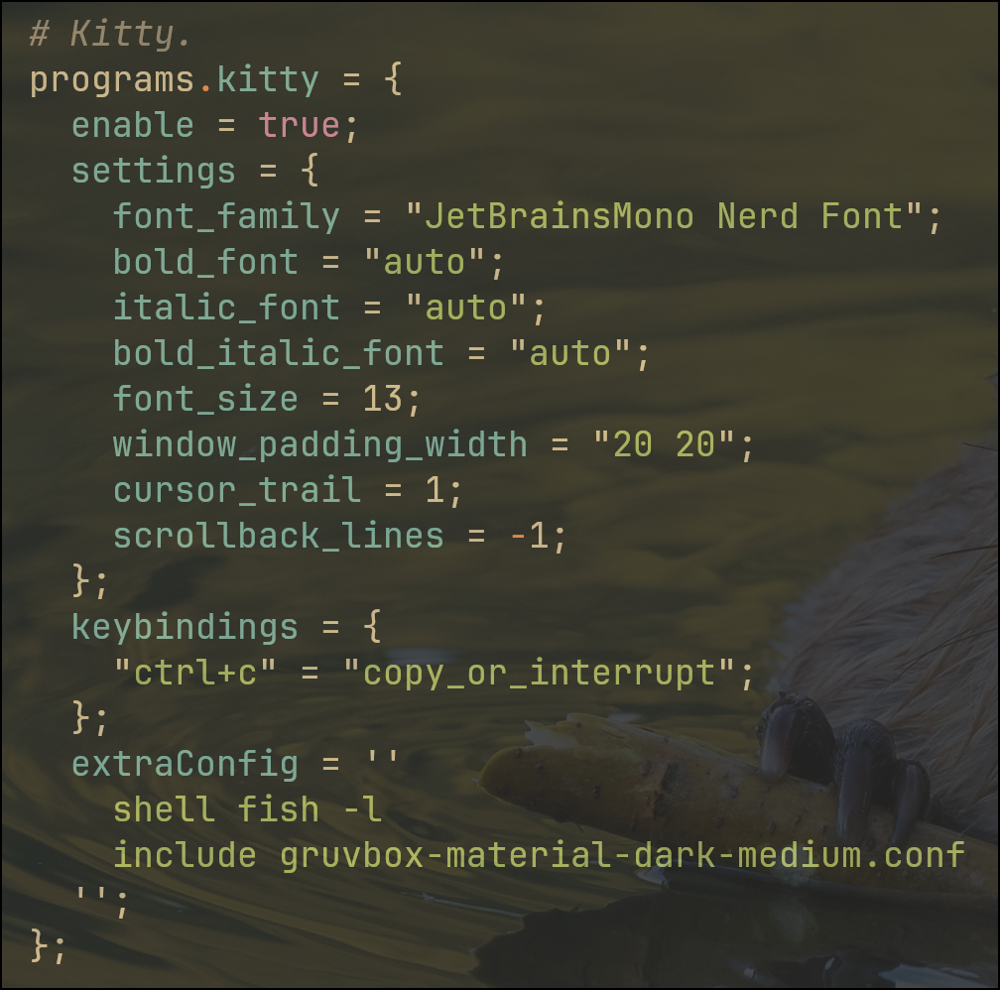

## Overview

I built a flake-based NixOS and Home Manager configuration for a customized Linux desktop and reproducible multi-language development workflow.

This project combines system configuration, package management, desktop customization, and workflow automation into a declarative setup that can be rebuilt consistently from code.

## Goals

I wanted an environment that would let me:

- manage system configuration declaratively
- reduce configuration drift over time
- support development across multiple languages such as Python, C#, and Rust
- customize my desktop workflow for daily use
- make system changes easier to reproduce and maintain

## What I Built

The project is organized around a small set of configuration files:

- `flake.nix` for flake inputs, outputs, and system composition
- `configuration.nix` for system-level services and hardware behavior
- `home.nix` for user-level packages, terminal settings, and desktop workflow
- `hardware-configuration.nix` for hardware-specific definitions

Together, these files define both the operating system and the user environment in a reproducible way.

## Repository Structure

The repository is intentionally small and modular. The main files separate system configuration from user configuration, which makes the setup easier to understand and maintain.

Modular NixOS configuration showing the flake and declarative system files.

## Flake-Based Composition

The core of the project is a flake that defines the `charity` NixOS configuration and integrates Home Manager into the system.

This allows the operating system and user environment to be described together while keeping the structure modular.

Flake inputs and outputs wiring together NixOS, Home Manager, and the user configuration.

## System Configuration

At the system level, I configured services and system behavior declaratively.

This includes:

- `greetd` with `tuigreet` for starting a Hyprland session
- `keyd` for keyboard remapping
- system-level service configuration through `configuration.nix`
- a Linux desktop environment designed around reproducibility and control

Declarative configuration for login behavior and custom keyboard remapping.

## Terminal and Workflow Customization

At the user level, I used Home Manager to configure my development environment and desktop workflow.

One example is my Kitty terminal configuration, which defines:

- font settings
- shell behavior
- scrollback behavior
- custom theme integration
- keybindings

Home Manager configuration for terminal behavior, fonts, scrollback, and shell integration.

## Key Features

### Declarative Configuration
System and user settings are written in configuration files instead of being managed manually through repeated setup.

### Reproducible Development Environment
The configuration supports repeatable development workflows and helps reduce inconsistencies between sessions and tools.

### Modular Structure
The project is split across flake, system, and user configuration files so that each part has a clear role.

### Desktop Workflow Customization
The setup includes custom login behavior, keyboard remapping, terminal configuration, and user-environment tooling.

## What I Learned

This project changed the way I think about development environments and operating systems.

Instead of treating the environment as background setup, I started thinking of it as part of the system itself. Building this configuration helped me understand:

- how declarative systems improve maintainability
- how flakes help structure reproducible configurations
- how system-level and user-level configuration interact
- how to debug configuration, service, and workflow issues more systematically

It also strengthened my interest in Linux systems, technical architecture, and reproducible computing.

## Tools and Technologies

- NixOS
- Nix flakes
- Home Manager
- Linux
- Hyprland
- Kitty
- Fish
- keyd
- greetd

## Reflection

This project gave me a much deeper understanding of how a development environment can be designed intentionally instead of assembled manually.

It also showed me that infrastructure, desktop workflow, and software development are closely connected. A well-designed environment makes the rest of the work more reliable, more maintainable, and easier to reason about.
